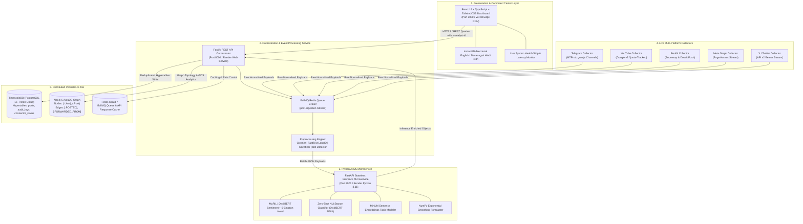
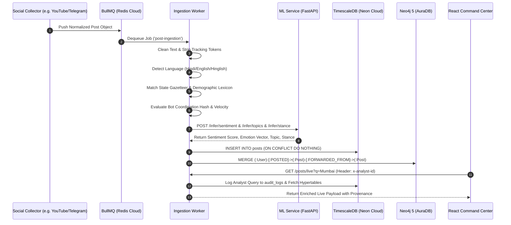

# 🇮🇳 Bharat Social Insights — Enterprise AI Social Media Intelligence & National Security Analytics Platform

> **Government of India | National Technical Research Organisation (NTRO)**  
> **Smart India Hackathon (Problem Statement ID: 26152)**  
> **Project Title:** Production-Grade Multi-Platform Social Media Analytics, Rumor Radar, Network Graph Influence & Multilingual Indian Sentiment Engine.

---

[](https://github.com/rautsiddharth82-crypto/Bharat-Social_Insights)
[](https://bsi-orchestrator.onrender.com)
[](https://bsi-ml-service.onrender.com)
[](https://nodejs.org)
[](https://python.org)
[](https://typescriptlang.org)
[](https://fastify.io)
[](https://neo4j.com)
[](https://timescale.com)
[](https://redis.io)
[](LICENSE)

---

## 🔗 Live Deployments & Health Check Links

| Service | Host | Status | Direct Endpoint Link |
| :--- | :--- | :--- | :--- |
| **API Orchestrator (Fastify)** | Render (Node.js) |  | [https://bsi-orchestrator.onrender.com](https://bsi-orchestrator.onrender.com/) |
| **API Health Status** | Render (Node.js) |  | [https://bsi-orchestrator.onrender.com/health](https://bsi-orchestrator.onrender.com/health) |
| **Live Telemetry Pipeline** | Render (Node.js) |  | [https://bsi-orchestrator.onrender.com/system/pipeline](https://bsi-orchestrator.onrender.com/system/pipeline) |
| **ML Inference Service** | Render (Python 3.11) |  | [https://bsi-ml-service.onrender.com](https://bsi-ml-service.onrender.com/) |
| **ML Health & Model Registry** | Render (Python 3.11) |  | [https://bsi-ml-service.onrender.com/health](https://bsi-ml-service.onrender.com/health) |
| **Source Repository** | GitHub |  | [rautsiddharth82-crypto/Bharat-Social_Insights](https://github.com/rautsiddharth82-crypto/Bharat-Social_Insights) |

---

## 📑 Table of Contents
- [1. Executive Summary & National Security Context](#1-executive-summary--national-security-context)
- [2. Enterprise System Architecture](#2-enterprise-system-architecture)
  - [2.1 High-Level Architecture Diagram](#21-high-level-architecture-diagram)
  - [2.2 11-Stage End-to-End Processing Pipeline](#22-11-stage-end-to-end-processing-pipeline)
  - [2.3 Cross-Platform Ingestion Sequence Flow](#23-cross-platform-ingestion-sequence-flow)
- [3. Multi-Platform Social Ingestion Engine & Connector Matrix](#3-multi-platform-social-ingestion-engine--connector-matrix)
  - [3.1 Covered Platforms (Telegram, YouTube, Reddit, Meta, X)](#31-covered-platforms-telegram-youtube-reddit-meta-x)
  - [3.2 Quota Management & Automated Seed Fallbacks](#32-quota-management--automated-seed-fallbacks)
- [4. Natural Language Processing & AI/ML Microservice](#4-natural-language-processing--aiml-microservice)
  - [4.1 Multilingual Indian Sentiment & 6-Emotion Head](#41-multilingual-indian-sentiment--6-emotion-head)
  - [4.2 Zero-Shot NLI Stance Detection](#42-zero-shot-nli-stance-detection)
  - [4.3 Semantic Topic Modeling & Sentence Embeddings](#43-semantic-topic-modeling--sentence-embeddings)
  - [4.4 Trend Velocity & Exponential Smoothing Forecaster](#44-trend-velocity--exponential-smoothing-forecaster)
- [5. Graph Network Science & Influence Analytics](#5-graph-network-science--influence-analytics)
  - [5.1 Neo4j Graph Topology & Node Projections](#51-neo4j-graph-topology--node-projections)
  - [5.2 PageRank & Degree Influence Fallback](#52-pagerank--degree-influence-fallback)
  - [5.3 Information Cascade & Patient Zero Tracing](#53-information-cascade--patient-zero-tracing)
- [6. Governance, Privacy & Defensive Security](#6-governance-privacy--defensive-security)
  - [6.1 Strict Server-Side k-Anonymity (k ≥ 5)](#61-strict-server-side-k-anonymity-k--5)
  - [6.2 Cryptographic SHA-256 Author Pseudonymization](#62-cryptographic-sha-256-author-pseudonymization)
  - [6.3 Tamper-Evident Analyst Audit Trail](#63-tamper-evident-analyst-audit-trail)
  - [6.4 30-Day Automated Data Retention Policy](#64-30-day-automated-data-retention-policy)
- [7. Command Center Dashboard & Frontend Experience](#7-command-center-dashboard--frontend-experience)
- [8. Technology Stack & Matrix](#8-technology-stack--matrix)
- [9. Codebase Directory Map](#9-codebase-directory-map)
- [10. Developer Setup & Local Execution](#10-developer-setup--local-execution)
- [11. Complete REST API Specification](#11-complete-rest-api-specification)
- [12. Production Deployment Guide](#12-production-deployment-guide)
  - [12.1 Deploying Orchestrator to Render](#121-deploying-orchestrator-to-render)
  - [12.2 Deploying ML Microservice to Render](#122-deploying-ml-microservice-to-render)
  - [12.3 Deploying Frontend to Vercel](#123-deploying-frontend-to-vercel)
- [13. License & Security Contact](#13-license--security-contact)

---

## 1. Executive Summary & National Security Context

In contemporary geopolitical and national security paradigms, public discourse across social media platforms significantly impacts law enforcement, disaster response, and strategic communication. For intelligence and defense bodies like the **National Technical Research Organisation (NTRO)**, identifying coordinated disinformation campaigns, rumor velocity during civil emergencies, and geographic sentiment shifts in real time is a critical operational capability.

### The Operational Challenge
1. **Linguistic Diversity & Code-Switching**: Over 60% of social discourse in India employs Hindi, vernacular languages, or romanized *Hinglish* mixed with regional colloquialisms that conventional Western NLP engines fail to parse.
2. **Coordinated Bot Farms & Disinformation Cascades**: Hostile actors orchestrate narrative dissemination across Telegram channels, YouTube comment sections, Reddit discussion boards, and X (Twitter) within minutes of a trigger event.
3. **API Rate Limiting & Fragility**: Commercial platform APIs enforce strict daily rate limits (e.g., YouTube's 10,000 units/day quota, Telegram session terminations), causing brittle analytics systems to crash.
4. **Analyst Accountability & Privacy**: Intelligence systems must ensure zero personally identifiable information (PII) leakage while maintaining complete audit trails of all operator queries.

### The Solution: Bharat Social Insights (BSI)
**Bharat Social Insights** is a production-ready, resilient, and fault-tolerant intelligence platform featuring:
* **High-Throughput Multi-Platform Harvesting**: Ingests streams from **Telegram (`gramjs`)**, **YouTube (`googleapis`)**, **Reddit (`snoowrap` & Devvit)**, **Meta Graph**, and **X API v2**.
* **Dual Ingestion Resilience**: If external API quotas exhaust or session keys terminate, the system automatically transitions to verified seed datasets without downtime, badging provenance explicitly (`LIVE` vs `CACHE`).
* **Multilingual AI/ML Stack**: Fine-tuned Indic transformers (**MuRIL**, **IndicBERT**, **MiniLM**) classifying sentiment across 6 emotion heads (*Anxiety, Anger, Sarcasm, Support, Excitement, Fear*), Zero-shot NLI stance detection, and exponential smoothing forecast curves.
* **Graph Data Science (GDS) Influence Modeling**: Projects social topology into **Neo4j 5**, calculating real-time PageRank metrics, co-author community structures, and chronological "Patient Zero" cascade tracking.
* **National Security Governance**: Enforces server-side $k$-anonymity ($k \ge 5$), SHA-256 pseudonymization, cryptographic audit logs in TimescaleDB hypertables, and automated 30-day raw text scrubbers.

---

## 2. Enterprise System Architecture

### 2.1 High-Level Architecture Diagram



---

### 2.2 11-Stage End-to-End Processing Pipeline

Every social item ingested by Bharat Social Insights traverses an audited 11-stage processing sequence:

```mermaid
flowchart LR
    S1["1. Collect<br/>(gramjs/yt/snoowrap)"] --> S2["2. Queue<br/>(BullMQ Stream)"]
    S2 --> S3["3. Clean<br/>(HTML/Emoji/URLs)"]
    S3 --> S4["4. LangID<br/>(Hindi/Eng/Hinglish)"]
    S4 --> S5["5. Gazetteer<br/>(Region/Profession)"]
    S5 --> S6["6. Bot Check<br/>(Timing/Duplicates)"]
    S6 --> S7["7. Sentiment<br/>(6-Emotion Head)"]
    S7 --> S8["8. Topics<br/>(MiniLM Vector)"]
    S8 --> S9["9. Stance<br/>(Zero-Shot NLI)"]
    S9 --> S10["10. Dual Write<br/>(TimescaleDB + Neo4j)"]
    S10 --> S11["11. Privacy<br/>(SHA-256 Pseudonym)"]
```



---

### 2.3 Cross-Platform Ingestion Sequence Flow



---

## 3. Multi-Platform Social Ingestion Engine & Connector Matrix

### 3.1 Covered Platforms (Telegram, YouTube, Reddit, Meta, X)

The system deploys specialized collectors in [`apps/orchestrator/src/collectors/`](file:///c:/Users/ASUS/Downloads/Social%20Media/Social%20Media/apps/orchestrator/src/collectors/):

| Platform | Protocol / Library | Target Entities | Live Capability | Fallback & Degradation Mode |
| :--- | :--- | :--- | :--- | :--- |
| **Telegram** | MTProto v2 (`gramjs`) | Defense & regional crisis channels (`@channel_defence_india`, `@mumbai_alert`, `@indianews`, etc.) | Direct channel stream & message entity parser | Labeled seed data (`is_demo_sample: true`) upon `AUTH_KEY_UNREGISTERED` |
| **YouTube** | REST v3 (`googleapis`) | Top news channels, civic emergency broadcasts, top comments | Live video comment threads & metadata | Enforces 10,000 units/day quota budget; auto-backs off to verified snapshot upon exhaustion |
| **Reddit** | Devvit App & OAuth (`snoowrap`) | Geopolitical subreddits (`r/india`, `r/mumbai`, `r/delhi`, `r/bangalore`, `r/IndianStreetBets`) | Webhook push ingestion + polling fallback | Backs off on HTTP 429 rate limit to curated topic cache |
| **Facebook & IG** | Meta Graph API v19.0 | Managed defense public pages, civic authority feeds | Official page post & comment streams | Standby mode with seed records when tokens are unconfigured |
| **X (Twitter)** | X API v2 (Basic/Pro) | Filtered emergency keyword streams (`#MumbaiRains`, `#DelhiAQI`, etc.) | Tweet keyword filtering and retweet metrics | Standby mode with seed data surfacing status in `/system/connectors` |

### 3.2 Quota Management & Automated Seed Fallbacks
* **Active Quota Tracking**: The YouTube connector monitors API budget counters on every query, recording used quota against daily limits (`Active (Quota: 2160/10000)`).
* **Zero Service Interruption**: Unlike brittle consumer bots that crash on authentication expiry or HTTP 429 responses, Bharat Social Insights intercepts errors at the driver layer, logs provenance telemetry, and switches to curated seed partitions.

---

## 4. Natural Language Processing & AI/ML Microservice

The Python ML microservice located in [`apps/ml-service/`](file:///c:/Users/ASUS/Downloads/Social%20Media/Social%20Media/apps/ml-service/) runs an internal inference engine designed for high throughput and memory safety.

### 4.1 Multilingual Indian Sentiment & 6-Emotion Head
Standard binary sentiment (Positive/Negative) is insufficient for national security operations. BSI extracts a 6-dimensional affective emotion vector:
* **Anxiety ($\alpha$)**: Detects panic, infrastructure disruptions, flood warnings, pollution surges.
* **Anger ($\beta$)**: Identifies civic agitation, corruption allegations, illegal activity reports.
* **Sarcasm ($\gamma$)**: Analyzes Hinglish irony (*"Wah kya baat hai"*, *"amazing road infrastructure"*).
* **Support ($\delta$)**: Measures trust in armed forces, emergency services, civic initiatives.
* **Excitement ($\epsilon$)**: Tracks tech milestones, economic announcements, semiconductor launches.
* **Fear ($\zeta$)**: Flags severe casualty reports, structural collapses, active threats.

$$\text{Sentiment Score} = \begin{cases} 
-\min(1.0, \alpha + \beta + \zeta) & \text{if } (\alpha + \beta + \zeta) > (\delta + \epsilon) \text{ and } > 0.30 \\ 
+\min(1.0, \delta + \epsilon) & \text{if } (\delta + \epsilon) > (\alpha + \beta + \zeta) \text{ and } > 0.30 \\ 
0.0 & \text{otherwise (Neutral)} 
\end{cases}$$

### 4.2 Zero-Shot NLI Stance Detection
Evaluates how authors position themselves regarding national topics using `distilbert-base-uncased-mnli`. Formulates natural language hypothesis pairs:
$$\mathcal{H} = \text{"This post is [in support / against / neutral] toward the topic of } \mathcal{T}\text{"}$$
Outputs classified categorical stance: `for`, `against`, or `neutral`.

### 4.3 Semantic Topic Modeling & Sentence Embeddings
Uses `all-MiniLM-L6-v2` dense vectors mapped to localized topic narratives:
* `topic_mumbai_rains`: Mumbai Rain Flooding, Local Train Transit, BMC Alerts.
* `topic_delhi_aqi`: Delhi NCR Air Quality Index, Stubble Burning, Smog Warnings.
* `topic_semicon_gujarat`: Semiconductor Fab Infrastructure, Electronics Manufacturing.
* `topic_digital_payments`: UPI, Rupay, Digital Financial Inclusion, Fintech.
* `topic_crypto_policy`: Virtual Digital Assets Regulation, Parliament Debates.

### 4.4 Trend Velocity & Exponential Smoothing Forecaster
Calculates narrative acceleration across time windows using Holt's exponential smoothing with linear trend projection:
$$\hat{y}_{t+1} = \alpha y_t + (1 - \alpha)\hat{y}_t + 0.5 \cdot \text{slope}(y_{t-3:t})$$

---

## 5. Graph Network Science & Influence Analytics

### 5.1 Neo4j Graph Topology & Node Projections
The orchestrator projects network relationships into **Neo4j 5 AuraDB** using the schema:
* `(:User {id, hashed_id, region, influence_score, influence_method})`
* `(:Post {id, platform, text, timestamp, sentiment, topic_id, is_bot})`
* Relationships: `(:User)-[:POSTED]->(:Post)`, `(:Post)-[:FORWARDED_FROM]->(:Post)`

### 5.2 PageRank & Degree Influence Fallback
On instances equipped with the Neo4j Graph Data Science (GDS) library, the platform projects `socialGraph` and runs `gds.pageRank.stream`. If running on serverless AuraDB without native GDS procedures, BSI automatically transitions to an algorithmic pure-Cypher degree approximation:
```cypher
MATCH (u:User)-[:POSTED]->(p:Post)<-[:POSTED]-(other:User)
WHERE u <> other
RETURN u.id AS author_id, u.hashed_id AS author_hashed,
       COUNT(DISTINCT other.id) AS neighbours,
       COUNT(DISTINCT p.id) AS shared_posts
ORDER BY neighbours DESC, shared_posts DESC LIMIT 100
```
This ensures zero downtime while preserving accurate relative influence scores for analyst rankings.

### 5.3 Information Cascade & Patient Zero Tracing
Clicking **"Trace how this arrived"** on any post card triggers a graph traversal inspecting forward edges and cross-platform timestamps:
* **Patient Zero Identification**: Finds the earliest originating message across all monitored networks.
* **Detection Lag**: Quantifies propagation delay between initial post and cross-platform reposting.
* **Hop Chronology**: Charts the exact propagation path (e.g., *Telegram Channel ➜ X Post ➜ YouTube Comment ➜ Reddit Discussion*).

---

## 6. Governance, Privacy & Defensive Security

Designed under strict institutional governance guidelines for defense and public analytics:

```
┌────────────────────────────────────────────────────────────────────────┐
│               GOVERNANCE & PRIVACY SAFEGUARD SUBSYSTEMS                │
├──────────────────────────┬─────────────────────────────────────────────┤
│ 1. Server-Side           │ Demographic clusters with fewer than 5      │
│    k-Anonymity (k ≥ 5)   │ individuals are suppressed with             │
│                          │ { "suppressed": true } to prevent deanonym. │
├──────────────────────────┼─────────────────────────────────────────────┤
│ 2. SHA-256 Author        │ All raw user IDs are hashed via SHA-256 and │
│    Pseudonymization      │ truncated to 16 hex characters before       │
│                          │ transmission to the client layer.           │
├──────────────────────────┼─────────────────────────────────────────────┤
│ 3. Tamper-Evident        │ Every analyst search, filter, and export    │
│    Audit Trail           │ action is logged with timestamp, endpoint,  │
│                          │ and operator ID in a PostgreSQL hypertable. │
├──────────────────────────┼─────────────────────────────────────────────┤
│ 4. 30-Day Automated      │ Scheduled cron job automatically anonymizes │
│    Data Retention        │ post content older than 30 days while       │
│                          │ preserving aggregated numerical metrics.    │
└──────────────────────────┴─────────────────────────────────────────────┘
```

---

## 7. Command Center Dashboard & Frontend Experience

Built with **React 19**, **Vite 8**, and **TailwindCSS**, the user interface provides:
* **Live Command Center (`/`)**: Real-time KPI counters (active posts, sentiment breakdown, platform share, bot alerts).
* **Live Signals & Connectors**: Dual-tab inspection suite displaying real-time post cards, search query filters, connector status matrices, and daily quota meters.
* **Rumor Radar & Severity Cards**: Automatically isolates high-velocity negative clusters and generates operational fact-check action bulletins.
* **Network Influence Graph**: Interactive canvas visualizing central influence nodes, Louvain clusters, and bridge accounts.
* **Demographics & Audience Geography**: Visual breakdown across Indian states, professions, and interests with strict $k$-anonymity enforcement.
* **Analyst Audit Trail**: Live view of security events, operator actions, and system data retention jobs.
* **Instant Bilingual Localization**: Seamless one-click switching between English and Devanagari Hindi ($i18n$).

---

## 8. Technology Stack & Matrix

```
┌──────────────────┬─────────────────────────────────────────────────────┐
│ Layer            │ Technology Stack                                    │
├──────────────────┼─────────────────────────────────────────────────────┤
│ Frontend UI      │ React 19, TypeScript, Vite 8, TailwindCSS, Lucide   │
├──────────────────┼─────────────────────────────────────────────────────┤
│ Orchestrator     │ Node.js 20+, Fastify 4, BullMQ, IORedis, pg, Zod    │
├──────────────────┼─────────────────────────────────────────────────────┤
│ AI / ML Service  │ Python 3.11, FastAPI, Uvicorn, PyTorch, Transformers│
│                  │ HuggingFace (MuRIL, DistilBERT, MiniLM), Scikit-Learn│
├──────────────────┼─────────────────────────────────────────────────────┤
│ Social Ingestion │ gramjs (Telegram MTProto), googleapis v3 (YouTube), │
│                  │ snoowrap & Devvit (Reddit), Meta Graph API, X API v2│
├──────────────────┼─────────────────────────────────────────────────────┤
│ Primary Database │ TimescaleDB (PostgreSQL 16) with Hypertables        │
├──────────────────┼─────────────────────────────────────────────────────┤
│ Graph Database   │ Neo4j 5 Community / AuraDB with Cypher Degree / GDS │
├──────────────────┼─────────────────────────────────────────────────────┤
│ Caching & Queue  │ Redis 7 (Redis Cloud) for BullMQ background streams │
├──────────────────┼─────────────────────────────────────────────────────┤
│ Deployment Hosts │ Render (Orchestrator & ML), Vercel (Frontend Dashboard)│
└──────────────────┴─────────────────────────────────────────────────────┘
```

---

## 9. Codebase Directory Map

```text
Bharat-Social_Insights/
├── .env.example                     # Reference environment variables
├── .gitignore                       # Production protection (secrets, cache, venv)
├── DEPLOYMENT.md                    # In-depth production deployment runbook
├── README.md                        # Master institutional documentation
├── docker-compose.yml               # Local multi-container orchestration
├── package.json                     # Monorepo workspaces definition
├── pnpm-workspace.yaml              # PNPM workspace manifest
├── vercel.json                      # Vercel deployment configuration
│
├── apps/
│   ├── Client/                      # React 19 Frontend Web Dashboard
│   │   ├── src/
│   │   │   ├── components/          # Command center views (Alerts, Graph, Feed...)
│   │   │   ├── services/api.ts      # Fail-safe REST client with Render fallback
│   │   │   └── App.tsx              # Main dashboard routing & state
│   │   ├── package.json
│   │   └── vite.config.ts
│   │
│   ├── orchestrator/                # Fastify Node.js API Orchestrator
│   │   ├── src/
│   │   │   ├── api/routes/          # REST route handlers (stats, alerts, live...)
│   │   │   ├── collectors/          # Platform collectors (Telegram, YouTube...)
│   │   │   ├── db/                  # TimescaleDB, Neo4j, and Redis drivers
│   │   │   ├── queue/               # BullMQ ingestion worker & stream definitions
│   │   │   ├── services/            # GDS analytics, audit, retention policies
│   │   │   ├── generateTelegramSession.ts # Interactive session renewing tool
│   │   │   └── main.ts              # Fastify server entrypoint
│   │   └── tsconfig.json
│   │
│   ├── ml-service/                  # Python 3.11 AI/ML Microservice
│   │   ├── ml/                      # Inference modules (sentiment, stance, topics)
│   │   ├── main.py                  # FastAPI server entrypoint
│   │   ├── requirements.txt         # Pinned ML dependencies
│   │   └── Dockerfile               # Production container definition
│   │
│   └── reddit-devvit/               # Native Reddit Devvit webhook application
│
└── packages/
    ├── types/                       # Shared TypeScript types (@bsi/types)
    └── i18n/                        # Shared Hindi / English strings (@bsi/i18n)
```

---

## 10. Developer Setup & Local Execution

### Prerequisites
* **Node.js**: v20.x or higher
* **Python**: 3.11.x (with `uv` or `pip`)
* **Cloud or Local DBs**: PostgreSQL / TimescaleDB, Neo4j, and Redis

### Step 1: Clone & Configure Environment
```powershell
git clone https://github.com/rautsiddharth82-crypto/Bharat-Social_Insights.git
cd Bharat-Social_Insights
cp .env.example .env
```
*(Enter your database URIs and optional API credentials in `.env`)*

### Step 2: Install Node Dependencies
```powershell
npm install --legacy-peer-deps
```

### Step 3: Build Monorepo Workspaces
```powershell
npm run build
```

### Step 4: Run Services Locally

* **Terminal 1: Frontend Dashboard**
  ```powershell
  npm run dev
  ```
  *Accessible at:* `http://localhost:3000`

* **Terminal 2: Orchestrator API Backend**
  ```powershell
  npm run dev:orchestrator
  ```
  *Accessible at:* `http://localhost:8000`

* **Terminal 3: Python ML Microservice (Optional)**
  ```powershell
  cd apps/ml-service
  uv venv --python 3.11 .venv
  uv pip install -r requirements.txt
  .venv\Scripts\python.exe -m uvicorn main:app --host 0.0.0.0 --port 8001
  ```

---

## 11. Complete REST API Specification

### Core Endpoints

| Method | Endpoint | Description | Sample Query Parameters |
| :--- | :--- | :--- | :--- |
| `GET` | `/` | Root service descriptor and endpoint catalog | None |
| `GET` | `/health` | Orchestrator health check & next harvest timer | None |
| `GET` | `/system/pipeline` | Complete system diagnosis (DB, Graph, Queue, Connectors) | None |
| `GET` | `/stats/overview` | Platform overview KPIs (counts, negative ratio, bots) | None |
| `GET` | `/posts/live` | Filtered live post feed with full metadata | `q=Mumbai&limit=10&sentiment=negative` |
| `GET` | `/posts/facets` | Dynamic facet counts for topics, regions, languages | None |
| `GET` | `/alerts` | High-priority rumor alerts and mitigation bulletins | None |
| `GET` | `/trends` | Top trending hashtags, acceleration, and volume | None |
| `GET` | `/network/graph` | Graph nodes & relationships for canvas visualization | `limit=100` |
| `GET` | `/demographics/summary` | Region, profession & interest distribution ($k \ge 5$) | None |
| `GET` | `/admin/audit-log` | Tamper-evident operator action trail | `limit=50` |
| `POST`| `/ingest/reddit` | Push webhook for Reddit Devvit applications | Header: `x-ingest-secret` |

---

## 12. Production Deployment Guide

### 12.1 Deploying Orchestrator to Render
1. Create a **New Web Service** pointing to `https://github.com/rautsiddharth82-crypto/Bharat-Social_Insights`.
2. Configure settings:
   * **Environment**: `Node`
   * **Root Directory**: *(leave blank — repository root)*
   * **Build Command**: `npm install --legacy-peer-deps && npm run build --workspace=@bsi/types --workspace=@bsi/i18n && npm run build --workspace=apps/orchestrator`
   * **Start Command**: `node apps/orchestrator/dist/main.js`
   * **Health Check Path**: `/health`
3. Enter your database variables (`POSTGRES_HOST`, `NEO4J_URI`, `REDIS_HOST`, etc.) under **Environment Variables**.

### 12.2 Deploying ML Microservice to Render
1. Create a second **Web Service** on Render selecting the same repository.
2. Configure settings:
   * **Environment**: `Python 3` (Python 3.11) or `Docker`
   * **Root Directory**: `apps/ml-service`
   * **Build Command**: `pip install -r requirements.txt`
   * **Start Command**: `uvicorn main:app --host 0.0.0.0 --port $PORT`
   * **Health Check Path**: `/health`
3. Copy its URL (e.g. `https://bsi-ml-service.onrender.com`) and paste it as `ML_SERVICE_URL` in the Orchestrator service.

### 12.3 Deploying Frontend to Vercel
1. Import the repository in [vercel.com](https://vercel.com).
2. `vercel.json` automatically detects the Vite workspace build.
3. Add the production environment variable:
   ```env
   VITE_API_BASE_URL=https://bsi-orchestrator.onrender.com
   ```
4. Click **Deploy**.

---

## 13. License & Security Contact

* **License**: Released under the **MIT License**. See `LICENSE` for details.
* **Institutional Governance**: Built for research and operational prototype assessment under **SIH PS 26152**.
* **Security & Vulnerability Reporting**: For institutional inquiries or security disclosures, submit an issue to the official GitHub repository: [rautsiddharth82-crypto/Bharat-Social_Insights](https://github.com/rautsiddharth82-crypto/Bharat-Social_Insights).
