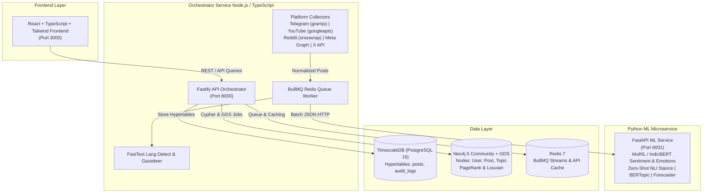

# Bharat Social Insights — AI Social Media Analytics Platform (SIH PS 26152)

Production-grade multi-platform social media analytics system built for **NTRO** featuring live data collection, trained HuggingFace ML models, Neo4j Graph Data Science (GDS) network influence analytics, Rumor Radar scoring, and an interactive React frontend with instant Hindi/Devanagari i18n support.

---

## System Architecture



---

## Live Data vs. Seed Data Fallback Matrix

| Platform | Connector Library | Live API Status | Fallback Behavior when API Keys are Missing |
| :--- | :--- | :--- | :--- |
| **Telegram** | `gramjs` | Live Channel Stream | Loads labeled `is_demo_sample=true` seed posts; status reported on `/system/connectors` |
| **YouTube** | `googleapis` (v3) | Live Video Comments | Enforces 10,000 units/day quota tracking; backs off gracefully to seed data when cap reached |
| **Reddit** | Devvit app (`apps/reddit-devvit`) or `snoowrap` | Live Subreddit Feed | **Recommended:** a Devvit Reddit app runs on Reddit's infra and pushes `r/india`, `r/mumbai`, … posts to `POST /ingest/reddit`. Legacy `snoowrap` poller is used when credentials are set; otherwise falls back to seed dataset. See `apps/reddit-devvit/README.md`. |
| **Facebook & IG** | Meta Graph API | Live Managed Pages | Connects to owned pages via Page Access Token; falls back to seed data if token is blank |
| **X (Twitter)** | X API v2 (Basic) | Live Keyword Stream | Primary path uses Bearer Token; falls back to labeled seed data and surfaces state explicitly |

---

## Getting Started & Docker Compose

### Prerequisites
- Docker Engine 24+ & Docker Compose v2+
- `Node.js` 20+ and `pnpm` (if running locally without Docker)

### Quick Start (Single Command)

1. Clone repository and copy environment configuration:
   ```bash
   cp .env.example .env
   ```

2. (Optional) Enter platform API credentials in `.env` (Telegram `API_ID`, YouTube `API_KEY`, Reddit credentials, etc.).

3. Bring up all 6 microservice containers:
   ```bash
   docker compose up --build
   ```

4. Access the user interfaces:
   - **Frontend Dashboard**: `http://localhost:3000`
   - **Orchestrator REST API**: `http://localhost:8000`
   - **Python ML Microservice Health**: `http://localhost:8001/health`
   - **Neo4j Browser**: `http://localhost:7474` (User: `neo4j`, Password: `password123`)

---

## Model Fine-Tuning Script

The Python ML microservice provides runnable fine-tuning scripts in `apps/ml-service/train/`:

```bash
cd apps/ml-service
python -m train.train_sentiment
```

This script fine-tunes a `google/muril-base-cased` checkpoint on multilingual Indian sentiment data and saves the output to `checkpoints/muril_sentiment`.

---

## Governance & Privacy Features

1. **Server-Side k-Anonymity ($k \ge 5$)**: Any demographic bucket with fewer than 5 users is suppressed in the API layer returning `{ "suppressed": true }`.
2. **Author Hashing**: All raw `author_id` strings are SHA-256 hashed before ever being transmitted to the frontend.
3. **Audit Logging**: Analyst queries are automatically recorded in the PostgreSQL `audit_logs` hypertable.
4. **Data Retention Policy**: Scheduled job purges/anonymizes raw post text older than 30 days while preserving aggregate metrics.
